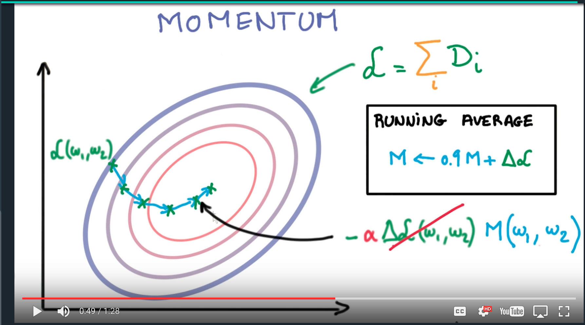
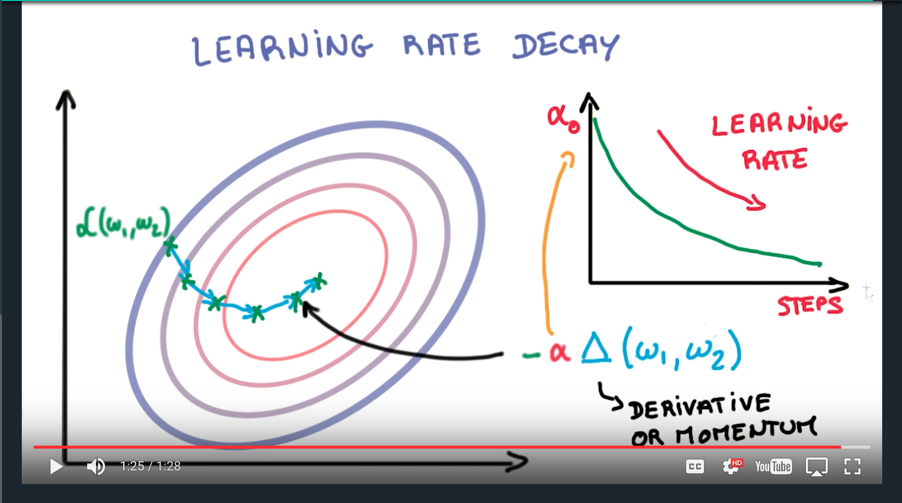

# From ML to DL

- Rule of 30: A change that affects more than 30 samples in the validation set can be considered as significant.
  - Suppose you have 3,000 samples in the validation set, a improvement in accuracy from 80% to 81% can be graded as significant (0.01 * 3000 = 30).

- Momentum
  - Usually can be used with S.G.D (stochastic gradient descent)
  - `M_i <- 0.9*M_{i-1} + G_i`, where `M_i` is the momentum used for updating weights in period `i`, `G_i` is the gradient of loss function on current batch of training data.
  - Learning Rate Decay.
  - ADAGRAD
    - [xcorr's Blog](https://xcorr.net/2014/01/23/adagrad-eliminating-learning-rates-in-stochastic-gradient-descent/)
    - [pdf Note](http://seed.ucsd.edu/mediawiki/images/6/6a/Adagrad.pdf)
    - [An overview of gradient descent](http://sebastianruder.com/optimizing-gradient-descent/index.html#adagrad)

